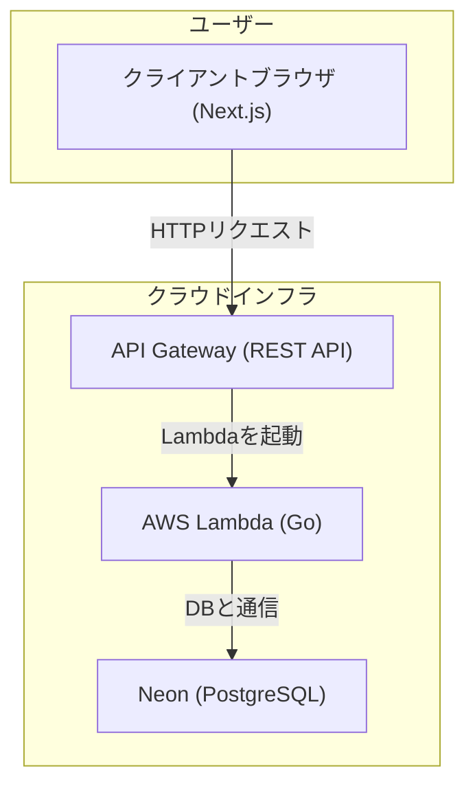

# Lambdaアーキテクチャ

```mermaid
graph TD
    subgraph "ユーザー"
        A["クライアントブラウザ (Next.js)"]
    end

    subgraph "クラウドインフラ"
        B["API Gateway (REST API)"]
        C["AWS Lambda (Go)"]
        D["Neon (PostgreSQL)"]
    end

    A -- "HTTPリクエスト" --> B
    B -- "Lambdaを起動" --> C
    C -- "DBと通信" --> D
```
